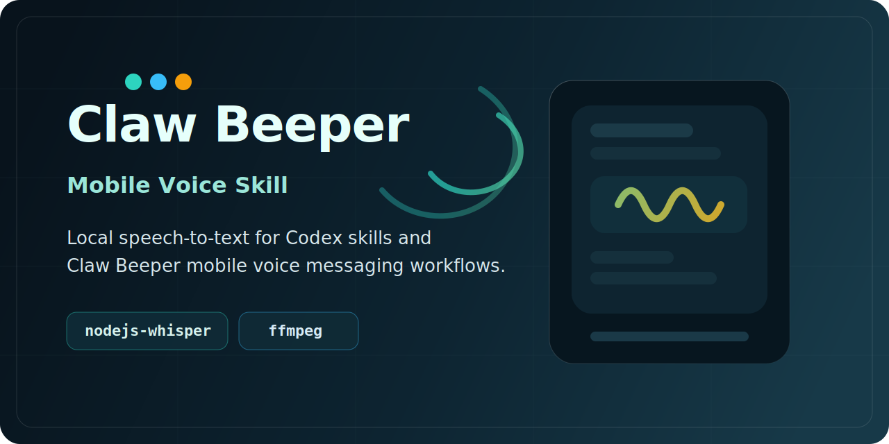

# Claw Beeper

<p align="center">
  <a href="./README.md">简体中文</a> | <a href="./README.en.md">English</a>
</p>

<p align="center">
  
</p>

<p align="center">
  <strong>一个面向 Claw Beeper 的 Codex 语音技能与本地转写 CLI。</strong>
</p>

<p align="center">
  
  
  
  
</p>

## 项目简介

Claw Beeper 是一个本地语音转写技能，面向 Codex 和 Claw Beeper 的移动端语音消息场景。它可以处理 `.ogg`、`.mp3`、`.wav`、`.m4a`、`.aac`、`.webm` 等音频文件，在需要时先转换成 Whisper 可用的 WAV，再通过一个轻量的 Node.js CLI 输出转写文本。

这个仓库同时包含了 Claw Beeper 移动端语音消息的产品侧接入说明，包括上传、消息创建、异步转写、转写结果回写和失败处理。

## 功能特性

- 基于 `nodejs-whisper` 的本地语音转文字
- 内置项目级 `ffmpeg` 支持
- 支持本地文件和远程音频 URL
- 支持文本和 JSON 两种输出格式
- 可直接接入 Claw Beeper 的异步 worker
- 包含移动端语音消息的设计、接入和排障说明

## 技术栈

| 层级 | 技术 |
| --- | --- |
| Runtime | Node.js 22+、CommonJS |
| Speech-to-text | `nodejs-whisper` |
| Audio conversion | FFmpeg |
| Whisper backend | `whisper.cpp` + `ggml-base.bin` |
| Skill metadata | `SKILL.md` + `agents/openai.yaml` |
| 目标环境 | Windows 优先的本地运行时 |

## 目录结构

```text
.
|-- README.md
|-- README.en.md
|-- SKILL.md
|-- package.json
|-- agents/
|   `-- openai.yaml
|-- assets/
|   `-- cover.svg
|-- references/
|   `-- workflow.md
|-- scripts/
|   `-- transcribe-audio.js
`-- tools/
    `-- ffmpeg/
```

## 当前运行时约定

当前仓库默认使用以下本地运行时布局：

- FFmpeg 二进制：`tools/ffmpeg/bin/ffmpeg.exe`
- Whisper 模型：`node_modules/nodejs-whisper/cpp/whisper.cpp/models/ggml-base.bin`
- Whisper CLI：`node_modules/nodejs-whisper/cpp/whisper.cpp/build/bin/whisper-cli.exe`

转写脚本会自动把项目内置的 FFmpeg 目录注入当前进程的路径。`whisper-cli.exe` 和模型文件仍然需要放在 `nodejs-whisper` 约定的位置。

## 安装

### 1. 安装 Node.js

使用 Node.js `22+`。

### 2. 安装依赖

```bash
npm install
```

### 3. 准备本地 Whisper 运行时

确保以下文件存在：

- `node_modules/nodejs-whisper/cpp/whisper.cpp/models/ggml-base.bin`
- `node_modules/nodejs-whisper/cpp/whisper.cpp/build/bin/whisper-cli.exe`

如果你在 Windows 上自行编译 `whisper-cli.exe`，还需要保证对应的 MinGW/MSYS2 运行时 DLL 已经通过用户 `Path` 可见，或者直接放在 `whisper-cli.exe` 同目录。

## 使用方法

### 基础转写

```bash
node scripts/transcribe-audio.js --input "C:/path/to/audio.ogg" --model base --format text
```

### JSON 输出

```bash
node scripts/transcribe-audio.js --input "C:/path/to/audio.ogg" --model base --format json
```

### 详细日志模式

```bash
node scripts/transcribe-audio.js --input "C:/path/to/audio.ogg" --model base --format text --verbose
```

### NPM 快捷命令

```bash
npm run check:transcribe
npm run transcribe -- --input "C:/path/to/audio.ogg" --model base --format text
npm run transcribe:verbose -- --input "C:/path/to/audio.ogg" --model base --format text
```

## CLI 参数

| 参数 | 说明 |
| --- | --- |
| `--input <path|url>` | 本地音频路径或远程 URL |
| `--model <name>` | Whisper 模型名，默认 `base` |
| `--format <json|text>` | 输出格式，默认 `json` |
| `--output <path>` | 将输出写入文件 |
| `--verbose` | 打印 `nodejs-whisper` 调试日志 |
| `--remove-wav-file` | 转写后删除中间 WAV |
| `--keep-wav-file` | 保留中间 WAV |
| `--with-cuda` | 可用时请求 `nodejs-whisper` 使用 CUDA |
| `--word-timestamps` | 请求词级时间戳 |
| `--translate-to-english` | 将源语言翻译成英文 |
| `--timestamps-length <n>` | 设置时间戳分段长度 |

## 支持的输入格式

- `.ogg`
- `.opus`
- `.mp3`
- `.wav`
- `.m4a`
- `.aac`
- `.webm`

非 WAV 文件会先转换成 `16kHz` 单声道 WAV，再进入转写。

## 输出示例

### `--format text`

```text
你可以听懂我说话吗?
```

### `--format json`

```json
{
  "provider": "nodejs-whisper",
  "model": "base",
  "sourcePath": "C:\\path\\to\\audio.ogg",
  "sourceName": "audio.ogg",
  "text": "你可以听懂我说话吗?",
  "raw": "..."
}
```

## 作为 Codex Skill 使用

Skill 入口定义在 [SKILL.md](./SKILL.md)。

它支持两类模式：

- 音频理解模式：转写用户提供的音频，并基于转写结果继续回答
- 产品实现模式：设计或扩展 Claw Beeper 的移动端语音消息能力

相关元数据定义在 [agents/openai.yaml](./agents/openai.yaml)。

## Claw Beeper 集成模型

这个仓库记录了 Claw Beeper 移动端语音消息的推荐流程：

1. 在移动端录音
2. 通过媒体上传链路上传音频
3. 创建一条 `voice` 类型消息，初始状态为 `pending` 或 `processing`
4. 通过 `scripts/transcribe-audio.js` 执行异步转写
5. 回写 `transcript_text`、`transcription_status` 和错误信息
6. 向客户端推送消息更新

详细接入说明见 [references/workflow.md](./references/workflow.md)。

## 常见问题

### Windows 退出码 `3221225781`

这通常表示 `whisper-cli.exe` 缺少运行时 DLL。常见修复方式：

- 把 MinGW/MSYS2 运行时目录加入用户 `Path`
- 或者把所需 DLL 直接复制到 `whisper-cli.exe` 同目录

### `Model file does not exist`

确认模型名和文件名一致。对于 `--model base`，文件必须是：

```text
node_modules/nodejs-whisper/cpp/whisper.cpp/models/ggml-base.bin
```

### FFmpeg 转换失败

确认这个文件存在：

```text
tools/ffmpeg/bin/ffmpeg.exe
```

### Git Bash 路径问题

如果你使用 Git Bash，优先使用正斜杠路径：

```bash
node scripts/transcribe-audio.js --input "C:/Users/Administrator/Desktop/test.ogg" --model base --format text
```

## 开发说明

- 当前仓库以 Windows 本地运行时为主
- FFmpeg 采用项目内置方式，不依赖系统级安装
- 当前文档和示例默认使用 `base` 模型
- 这个仓库更适合作为可运行原型和集成参考，而不是通用 npm 包

